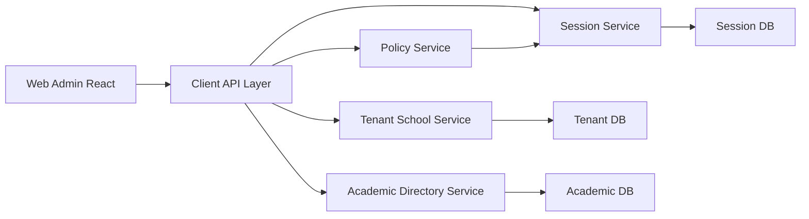
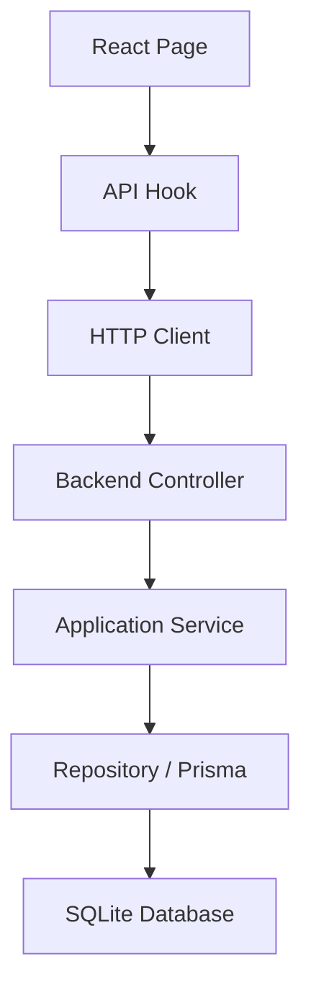
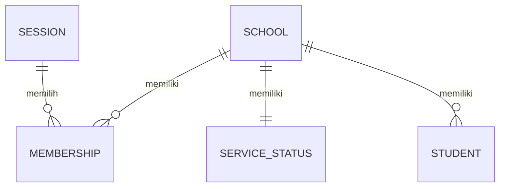

## 1. Desain Arsitektur


## 2. Deskripsi Teknologi
- Frontend: React 18 + TypeScript + Vite
- Styling: Tailwind CSS 3 + CSS variables untuk tema
- State client: React Query untuk fetch/cache, React Context untuk session state
- Routing: React Router
- Form: React Hook Form + Zod resolver
- Inisialisasi: Vite React TypeScript

## 3. Definisi Route
| Route | Tujuan |
|-------|--------|
| `/login` | Halaman login dan pilih tenant |
| `/dashboard` | Ringkasan session aktif |
| `/capabilities` | Menampilkan capability user aktif |
| `/service-status` | Menampilkan dan mengubah status layanan sekolah aktif |
| `/students` | Menampilkan daftar siswa dan form tambah siswa |

## 4. Definisi API
```ts
type LoginRequest = {
  provider: "google" | "firebase" | "demo";
  idToken: string;
};

type LoginResponse = {
  sessionId: string;
  memberships: Array<{
    membershipId: string;
    schoolId: string;
    role: string;
    status: "active" | "inactive" | "suspended";
  }>;
};

type SessionMeResponse = {
  session: {
    sessionId: string;
    userId: string;
    activeSchoolId: string | null;
    activeMembershipId: string | null;
    activeRole: string | null;
  };
};

type ServiceStatusResponse = {
  serviceStatus: {
    schoolId: string;
    serviceStatus: "active" | "limited" | "disabled";
    reason: string | null;
    updatedAt: string;
  };
};

type StudentDto = {
  studentId: string;
  schoolId: string;
  studentNumber: string;
  fullName: string;
  status: "active" | "inactive";
  createdAt: string;
  updatedAt: string;
};
```

Endpoint yang digunakan:
- `POST /v1/sessions/login`
- `GET /v1/sessions/me`
- `POST /v1/sessions/select-tenant`
- `GET /v1/policies/capabilities`
- `GET /v1/schools/{schoolId}/service-status`
- `PATCH /v1/schools/{schoolId}/service-status`
- `GET /v1/students`
- `POST /v1/students`

## 5. Diagram Arsitektur Server


## 6. Model Data
### 6.1 Definisi Model Data


### 6.2 Definisi Data
```sql
-- Data inti sudah dikelola oleh service backend yang ada.
-- Web-admin tidak membuat tabel baru.
-- Frontend hanya mengonsumsi tabel/logika yang sudah ada:
-- Session(sessionId, userId, activeSchoolId, activeMembershipId, activeRole)
-- School(schoolId, name, status)
-- ServiceStatus(schoolId, serviceStatus, reason, updatedAt)
-- Membership(membershipId, schoolId, role, status)
-- Student(studentId, schoolId, studentNumber, fullName, status, createdAt, updatedAt)
```
