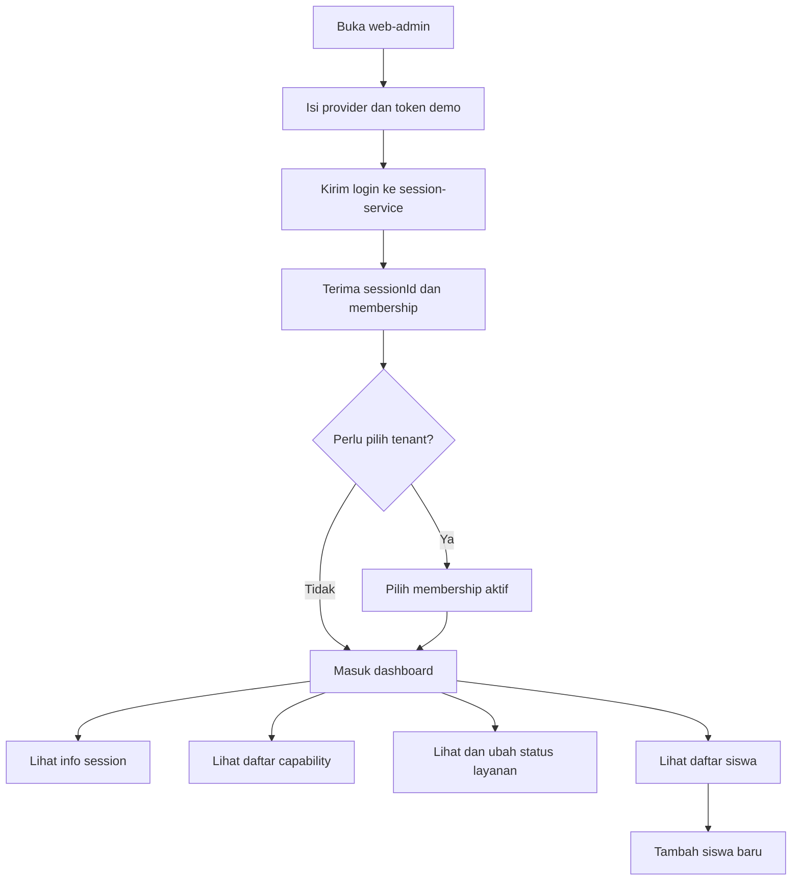

## 1. Gambaran Produk
`web-admin` adalah surface minimum berbasis browser untuk mengoperasikan backend Unified-System V2 yang sudah dibangun secara bertahap.
- Tujuan utamanya adalah memberi antarmuka admin internal untuk login, melihat konteks session, memeriksa capability, mengelola status layanan sekolah, melihat daftar siswa, dan menambah data siswa.
- Nilai produk pada tahap ini adalah mempercepat validasi end-to-end backend POC tanpa menunggu aplikasi mobile penuh.

## 2. Fitur Inti
### 2.1 Peran Pengguna
| Peran | Metode Akses | Izin Inti |
|------|--------------|-----------|
| Admin Sekolah | Login memakai token identitas demo/backend POC | Login, pilih tenant, lihat capability, kelola status layanan, lihat dan tambah siswa |
| Principal | Login memakai membership principal | Lihat session, capability, dan status layanan sesuai capability baca |

### 2.2 Modul Fitur
1. **Halaman Login**: form login sederhana, status loading, pesan error, hasil login session.
2. **Dashboard Session**: ringkasan session aktif, tenant aktif, role aktif, dan navigasi modul.
3. **Halaman Capability**: daftar capability dari `policy-service` untuk user aktif.
4. **Halaman Status Layanan**: lihat dan ubah `service-status` sekolah aktif.
5. **Halaman Siswa**: daftar siswa sekolah aktif dan form tambah siswa sederhana.

### 2.3 Rincian Halaman
| Nama Halaman | Nama Modul | Deskripsi Fitur |
|--------------|------------|-----------------|
| Login | Form login | Input provider dan token demo, submit ke session-service, tampilkan hasil login/error |
| Login | Pemilih tenant | Jika membership lebih dari satu, user dapat memilih tenant aktif setelah login |
| Dashboard | Ringkasan session | Menampilkan `userId`, `activeSchoolId`, `activeRole`, dan status autentikasi |
| Dashboard | Navigasi cepat | Tombol menuju capability, status layanan, dan siswa |
| Capability | Daftar capability | Mengambil `GET /v1/policies/capabilities` dan menampilkan daftar capability aktif |
| Status layanan | Panel service status | Mengambil dan mengubah `GET/PATCH /v1/schools/{schoolId}/service-status` |
| Siswa | Tabel siswa | Mengambil `GET /v1/students` dengan konteks tenant aktif |
| Siswa | Form siswa | Mengirim `POST /v1/students` dengan validasi dasar dan umpan balik hasil |

## 3. Proses Inti
Alur utama dimulai dari login, mengambil session aktif, memilih tenant bila diperlukan, lalu masuk ke dashboard untuk memanggil modul capability, status layanan, dan siswa. Semua aksi memakai bearer token session yang dihasilkan session-service.

## 4. Desain Antarmuka
### 4.1 Gaya Desain
- Warna utama: biru tua tinta, putih tulang, abu lembut, aksen hijau status
- Gaya tombol: sudut medium, kontras tinggi, hover halus, fokus jelas
- Tipografi: satu display font modern berkarakter untuk heading dan satu sans-serif bersih untuk body
- Tata letak: desktop-first dengan shell dua kolom, panel ringkas, tabel ringan, dan form modular
- Saran ikon: ikon outline sederhana untuk session, kebijakan, sekolah, dan siswa

### 4.2 Ikhtisar Desain Halaman
| Nama Halaman | Nama Modul | Elemen UI |
|--------------|------------|-----------|
| Login | Form utama | kartu besar terpusat, latar tekstur halus, tombol primer tegas, umpan balik inline |
| Dashboard | Ringkasan | kartu metadata session, panel statistik sederhana, nav panel kiri |
| Capability | Daftar | list atau chip capability, badge role, filter ringan |
| Status layanan | Panel status | radio/select status, badge kondisi, catatan audit singkat |
| Siswa | Tabel dan form | tabel desktop lebar, toolbar tenant, drawer/form tambah siswa |

### 4.3 Responsivitas
Antarmuka dirancang desktop-first untuk penggunaan admin kantor, lalu menurun dengan aman ke tablet. Mobile hanya bersifat adaptif dasar, bukan prioritas utama tahap POC.
